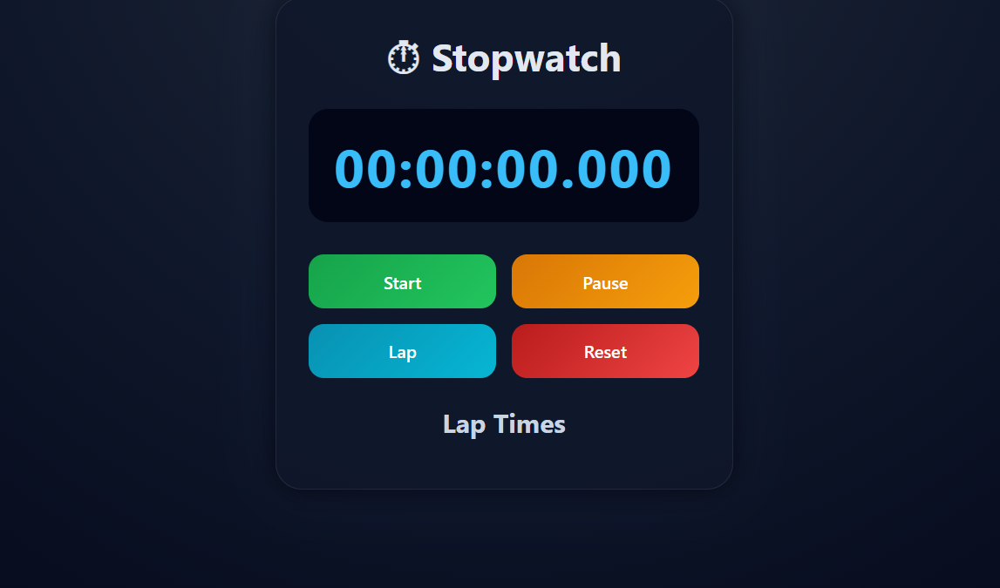

# ⏱ Stopwatch Web Application

A modern and responsive stopwatch web application built using HTML, CSS, and JavaScript.

The application allows users to accurately track time with millisecond precision, record lap times, and control the stopwatch using start, pause, and reset functionalities.

---

# 🚀 Features

- Start Stopwatch
- Pause Stopwatch
- Reset Stopwatch
- Record Lap Times
- Millisecond Precision
- Responsive Design
- Modern User Interface

---

# 🛠 Technologies Used

- HTML5
- CSS3
- JavaScript

---

# 📂 Project Structure

```text
stopwatch-project/
│
├── screenshots/
│   ├── home.png
│   └── laps.png
│
├── index.html
├── style.css
├── script.js
└── README.md
```

# ▶️ How to Run Locally

1. Download or clone the repository

```bash
git clone https://github.com/veenalaharikarupattu-web/SCT_WD_2.git
```

2. Open the project folder

```bash
cd stopwatch-project
```

3. Open `index.html` in your browser

---

# 📸 Screenshots

## Home Screen



## Lap Feature


---

# 🎯 Future Improvements

- Dark / Light Theme Toggle
- Keyboard Shortcuts
- Export Lap Times
- Sound Effects
- Mobile App Version

---

# 👨‍💻 Author

Veena Lahari K